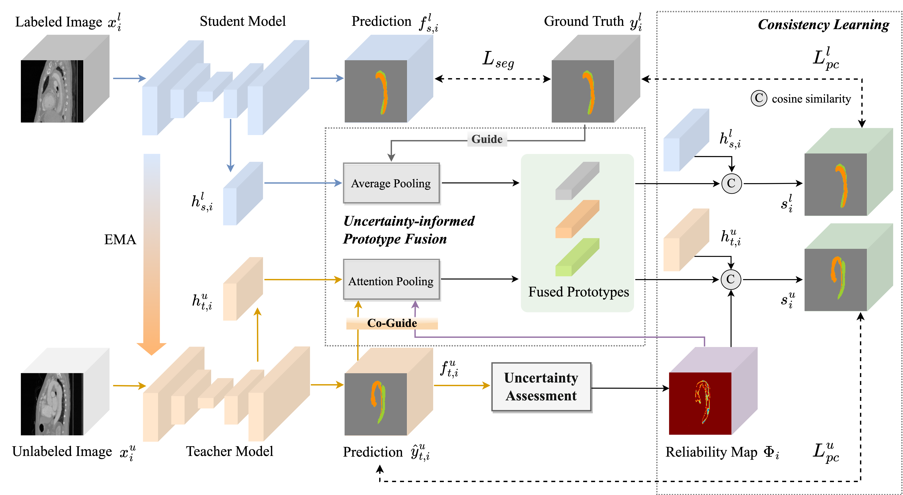

# UPCoL: Uncertainty-informed Prototype Consistency Learning for Semi-supervised Medical Image Segmentation

[](https://link.springer.com/chapter/10.1007/978-3-031-43901-8_63)

Pytorch implementation of our method for MICCAI 2023 paper: "UPCoL: Uncertainty-informed Prototype Consistency Learning for Semi-supervised Medical Image Segmentation".

## Contents

- [Abstract](##Abstract)
- [Datasets](##Datasets)
- [Usage](##Usage)
- [Visualization](##Visualization)
- [Acknowledgment](##Acknowledgment)

## Abstract



Semi-supervised learning (SSL) has emerged as a promising approach for medical image segmentation, while its capacity has still been limited by the difficulty in quantifying the reliability of unlabeled data and the lack of effective strategies for exploiting unlabeled regions with ambiguous predictions. To address these issues, we propose an Uncertainty-informed Prototype Consistency Learning (UPCoL) framework, which learns fused prototype representations from labeled and unlabeled data judiciously by incorporating an entropy-based uncertainty mask. The consistency constraint enforced on prototypes leads to a more discriminative and compact prototype representation for each class, thus optimizing the distribution of hidden embeddings. We experiment with two benchmark datasets of two-class semi-supervised segmentation, left atrium and pancreas, as well as a three-class multi-center dataset of type B aortic dissection. For all three datasets, UPCoL outperforms the state-of-the-art SSL methods, demonstrating the efficacy of the uncertainty-informed prototype learning strategy.

## Datasets

**Dataset licensing term**:

* Pancreas dataset: https://wiki.cancerimagingarchive.net/display/Public/Pancreas-CT
* Left atrium dataset: http://atriaseg2018.cardiacatlas.org 
* Type B Aorta Dissection dataset: https://github.com/XiaoweiXu/Dataset_Type-B-Aortic-Dissection     

**Preprocess**: refer to the image pre-processing method in  [SASSNet](https://github.com/kleinzcy/SASSnet), [CoraNet,](https://github.com/koncle/CoraNet) and [FUSSNet](https://github.com/grant-jpg/FUSSNet) for the Pancreas dataset and Left atrium dataset. The `preprocess` folder contains the necessary code to preprocess the pancreas and TBAD dataset. It is recommended to run `pancreas_preprocess.py` and `TBAD_preprocess.py` first to preprocess the data while using the raw dataset.

**Dataset split**: The `data_lists` folder contains the information about the train-test split for all three datasets.

## Usage

1. Clone the repo.;

   ```
   git clone
   ```

2. Train the model;

   ```
   cd ./UPCoL/codes
   
   # LA
   exp='LA'
   data_dir='../../../Datasets/LA_dataset'
   list_dir='../datalist/LA'
   
   python train.py --exp $exp --data_dir $data_dir --list_dir $list_dir --exp $exp
   
   # Pancreas
   exp='Pancreas'
   data_dir='../../../Datasets/Pancreas-processed'
   list_dir='../datalist/Pancreas/pancreas_X'
   
   python train.py --exp $exp --data_dir $data_dir --list_dir $list_dir --exp $exp
   
   # TBAD
   exp='AD'
   data_dir='../../../Datasets/TBAD128'
   list_dir='../datalist/AD/AD_0'
   
   python train.py --exp $exp --data_dir $data_dir --list_dir $list_dir --num_classes 3 --exp $exp
   ```

3. Test the model;

   ```
   cd ./UPCoL/codes
   
   # LA
   data_dir='../../../Datasets/LA_dataset'
   list_dir='../datalist/LA'
   load_path='../results/LA/checkpoints/'
   
   python test.py--data_dir $data_dir --list_dir $list_dir --load_path $load_path
   
   # Pancreas
   data_dir='../../../Datasets/Pancreas-processed'
   list_dir='../datalist/Pancreas'
   load_path='../results/Pancreas/checkpoints/'
   
   python test.py --data_dir $data_dir --list_dir $list_dir --load_path $load_path
   
   # TBAD
   data_dir='../../../Datasets/TBAD128'
   list_dir='../datalist/AD/AD_0'
   load_path='../results/AD/checkpoints/'
   
   python test.py --data_dir $data_dir --list_dir $list_dir --num_classes 3 --load_path $load_path
   ```

## Visualization

The `visualization` folder contains the necessary code to save and visualize the model output predictions, prototype predictions, and reliability maps in different training iterations. 

## Acknowledgment

Part of the code is adapted from the open-source codebase and original implementations of algorithms, we thank these authors for their fantastic and efficient codebase:

*  SASSNet: https://github.com/kleinzcy/SASSnet
* CoraNet: https://github.com/koncle/CoraNet
* SSL4MIS: https://github.com/HiLab-git/SSL4MIS
* FUSSNet: https://github.com/grant-jpg/FUSSNet
* PANet: https://github.com/kaixin96/PANet
